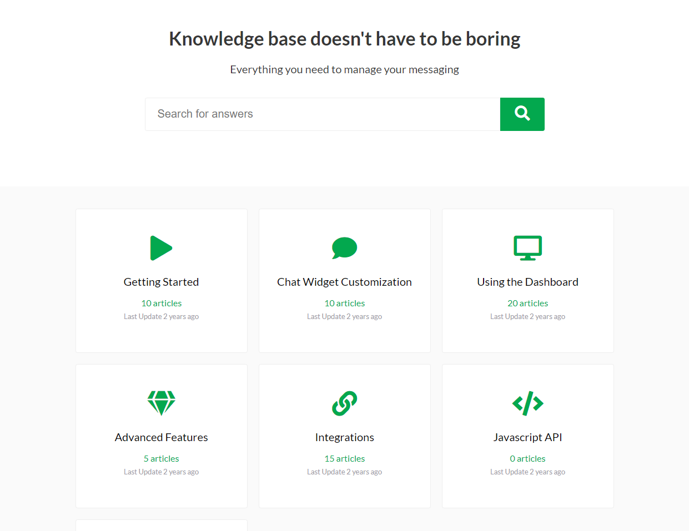
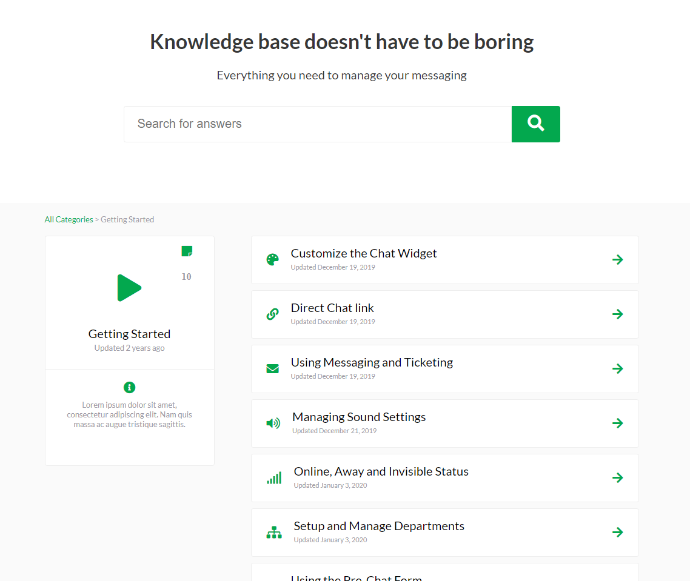

# Knowledge Base Website

A simple knowledge base site written in Vue js.  
This was my first vue js project which I had to learn within a day.  




### Install Dependencies

```
npm install
```

### Run Project

```
npm run start
```
